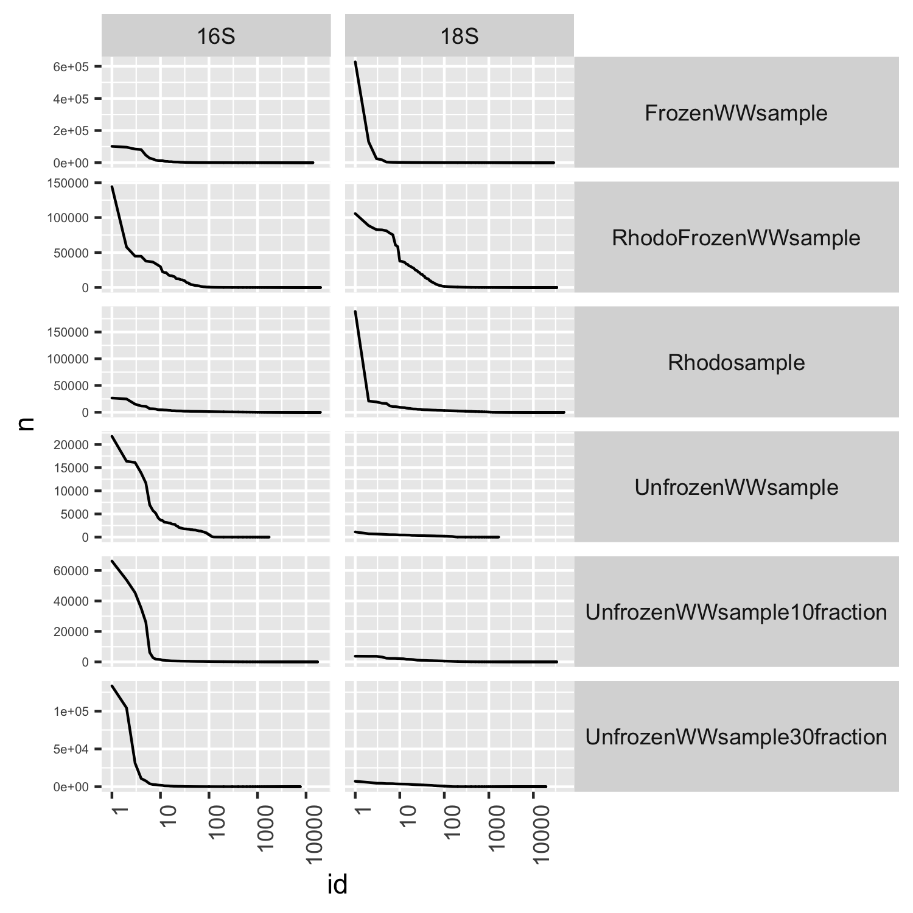
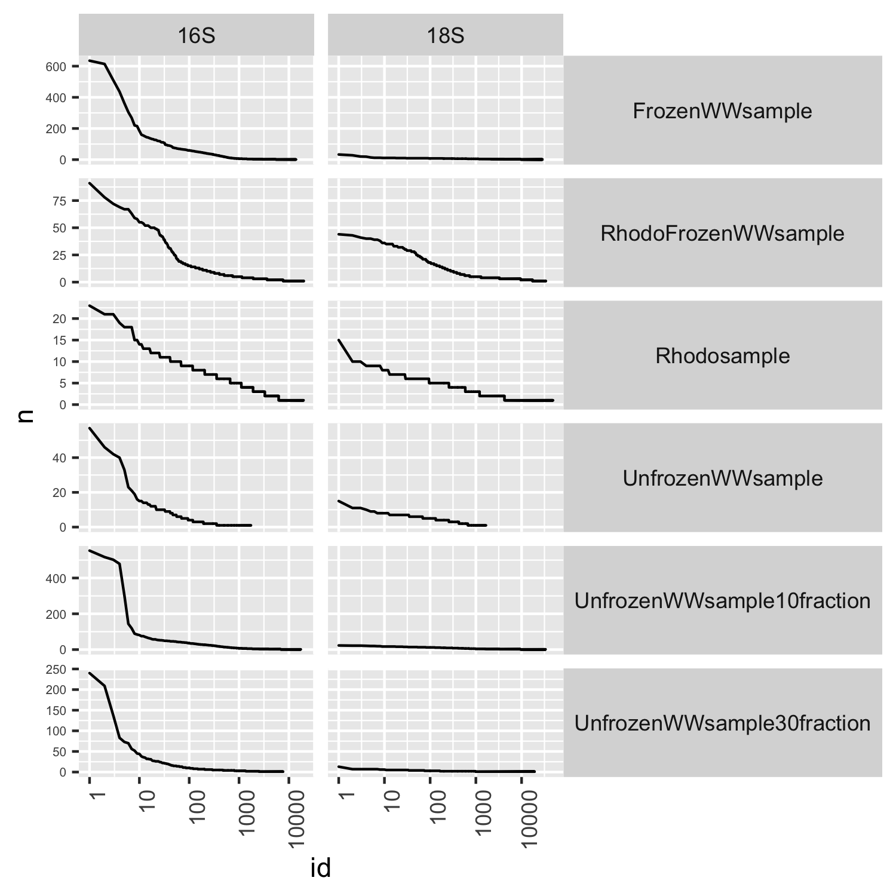
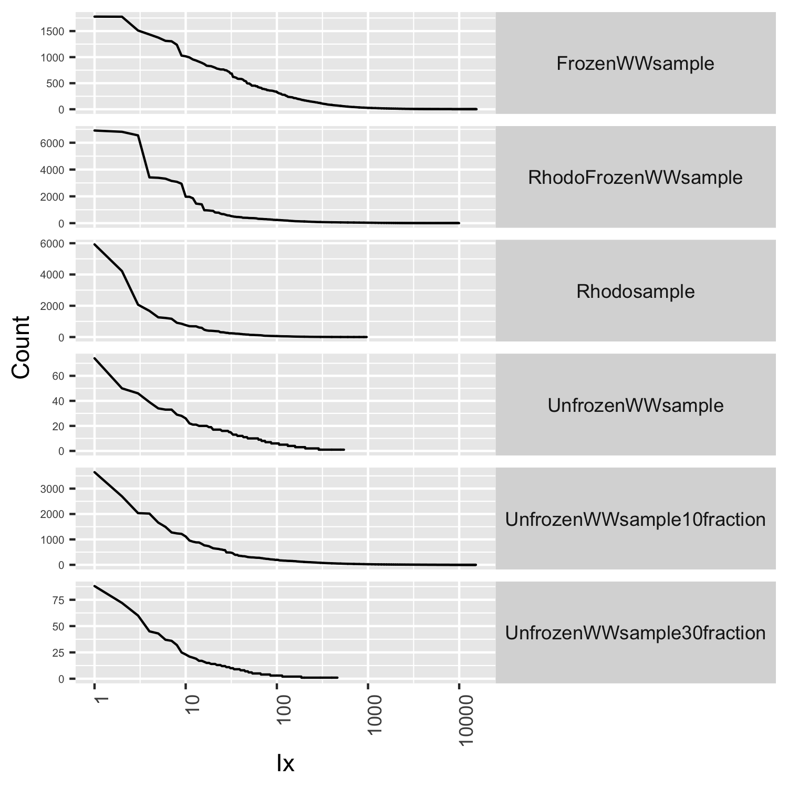
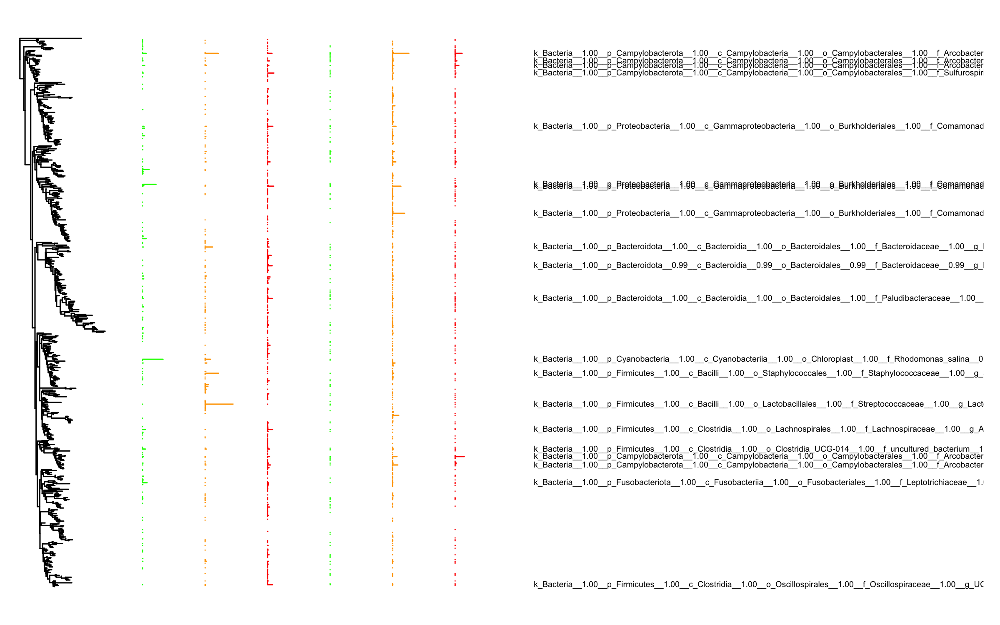
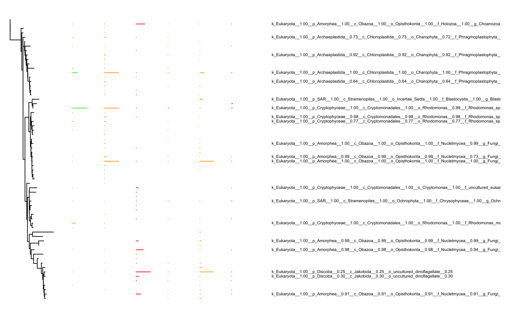

## Samples

-   Rhodosample: Rhodomonas only
-   FrozenWWsample: Waste water (frozen, 100 µm filtered)
-   RhodoFrozenWWsample: Rhodomonas + waste water (frozen, 100 µm
    filtered)
-   UnfrozenWWsample: Waste water (not frozen, 100 µm filtered)
-   UnfrozenWWsample10fraction: Waste water (not frozen, 30 - 100 µm
    fraction)
-   UnfrozenWWsample30fraction: Waste water (not frozen, 10 - 100 µm
    fraction)

## Barcode distributions

<table>
<tr>
<td>
Barcode distribution
</td>
<td>
Barcode taxonomy distribution
</td>
</tr>
<tr>
<td valign="top">

</td>
<td valign="top">

</td>
</tr>
</table>

## Distribution of connections

<td valign="top">

</td>

## Bacterial abundance profile

The abundance columns are:

-   Rhodomonas only
-   Waste water (frozen, 100 µm filtered)
-   Rhodomonas + waste water (frozen, 100 µm filtered)
-   Waste water (not frozen, 100 µm filtered)
-   Waste water (not frozen, 30 - 100 µm fraction)
-   Waste water (not frozen, 10 - 100 µm fraction)

<td valign="top">

</td>

## Eukaryotic abundance profile

The abundance columns are:

-   Rhodomonas only
-   Waste water (frozen, 100 µm filtered)
-   Rhodomonas + waste water (frozen, 100 µm filtered)
-   Waste water (not frozen, 100 µm filtered)
-   Waste water (not frozen, 30 - 100 µm fraction)
-   Waste water (not frozen, 10 - 100 µm fraction)

<td valign="top">

</td>

## Tanglegram of the mineral oil reactions

The abundance columns are:

-   Rhodomonas only
-   Waste water (frozen, 100 µm filtered)
-   Rhodomonas + waste water (frozen, 100 µm filtered)

<td valign="top">

</td>

## Tanglegram of the HFE7500 reactions

The abundance columns are:

-   Waste water (not frozen, 100 µm filtered)
-   Waste water (not frozen, 30 - 100 µm fraction)
-   Waste water (not frozen, 10 - 100 µm fraction)

<td valign="top">

</td>
